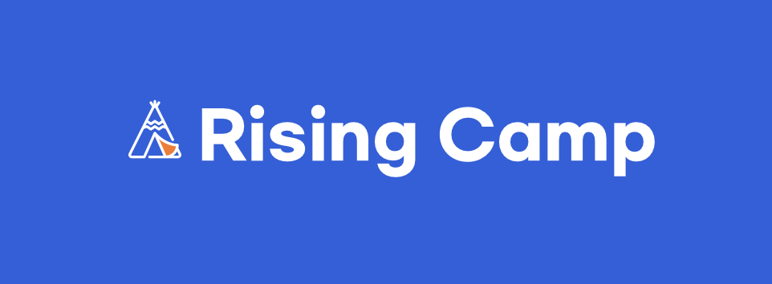

# Rising Camp 1기 🏕 
> 캠프 시작 : 21.06.19 ~    
> 기간 : 총 2달 동안 진행

## 📌 상세 커리큘럼
| 주차 | 커리큘럼 | 상세 내용 |
| :----------: | :----------: | :----------: |
| 1주차 | OT & 플랫폼 | 오리엔테이션, 플랫폼이란?, 개발자로서의 자세, Info.Plist, Layout 학습 및 Front-end |
| 2주차 | Life Cycle | 본격적인 프로그래밍을 진행하기 전, 생명주기 이해 및 활용법 숙지 |
| 3주차 | Table View | TableView의 이해와 토론을 바탕으로 Protocol,Delegate 패턴의 개념을 학습   실습을 통한 TableView 프로그래밍  진행 |
| 4주차 | Multi-Thread | Multi-Thread에 대한 토론 및 실습을 통해 쓰레드 프로그래밍을 학습 |
| 5주차 | Network Intro & API | 개괄적인 서버와 클라이언트 개요, HTTP 프로토콜에 대한 이해   API에 대한 이해 및 학습을 통한 서버 통신을 학습 |
| 6주차 | Token & Restful | RESTful API 및 로그인 방식의 이해(Session-Cookie, Auth, JWT)에 대해 학습 |
| 7주차 | Rising Test | 프론트엔드, 백엔드 실전 프로젝트(Rising Test) 진행 |
| 8주차 | Rising Test | 프론트엔드, 백엔드 실전 프로젝트(Rising Test) 진행 |

`🔥 RisingTest 통과 후 수료 가능`

## 📌 주차별 진행 상황
| 주차 | 날짜 | 커리큘럼 | 과제 | 수행 여부 |  리드미 이동 |   
| :----------: | :----------: | :----------: | :----------: | :----------: | :----------: | 
| 1주차 | 21.06.19 ~ 21.06.25 | OT & 플랫폼 | Zigzag App - 클론코딩 | 👗 | [이동](./1주차/Zigzag/readme.md) |
| 2주차 | 21.06.26 ~ 21.07.02 | Life Cycle | 메모장 App | 📝 | [이동](./2주차/MemoApp/readme.md) |
| 3주차 | 21.07.03 ~ 21.07.09 | Table View | 반려동물 사진 일기 App | 📔 | [이동](./3주차/AnimalDiary/readme.md) |
| 4주차 | 21.07.10 ~ 21.07.16 | Multi-Thread | 슈의 얼려먹는 초코 만들기 게임 | 🍫 | [이동](./4주차/MultiThreadGame/readme.md) |
| 5주차 | 21.07.17 ~ 21.07.23 | Network Intro & API | 강아지 산책 App | 🐕 | [이동](./5주차/PetWalk/readme.md) |
| 6주차 | 21.07.24 ~ 21.07.30 | Token & Restful | 라이징 테스트를 위해   '모듈화 작업' 및 'API 엮기' 공부 | 📖 | [이동](./6주차/readme.md) |
| 7주차 | 21.07.31 ~ 21.08.06 | Rising Test | 프론트엔드, 백엔드   실전 프로젝트 진행 | 🏕 | [이동](./7주차/readme.md) |
| 8주차 | 21.08.07 ~ 21.08.13 | Rising Test | 프론트엔드, 백엔드   실전 프로젝트 진행 | 🏕 | [이동](./8주차/readme.md) |
| 9주차 | 21.08.17 | 수료 발표 | `RisingTest 통과 및 수료` |  | [이동](./9주차/readme.md) |
| 10주차 | 21.09.02 | 수료식 | 수료증 및 혜택 전달 |  | [이동](./10주차/readme.md) |

